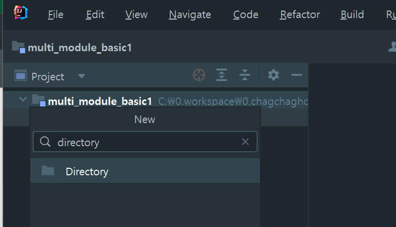
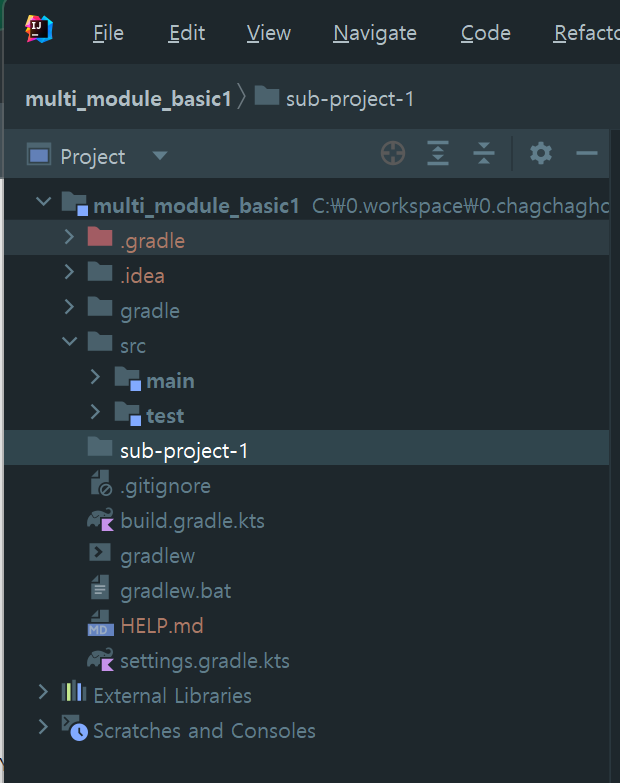
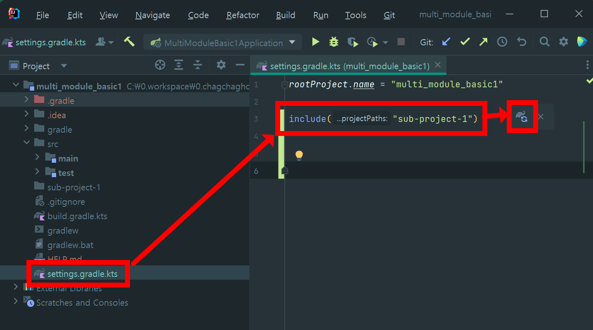
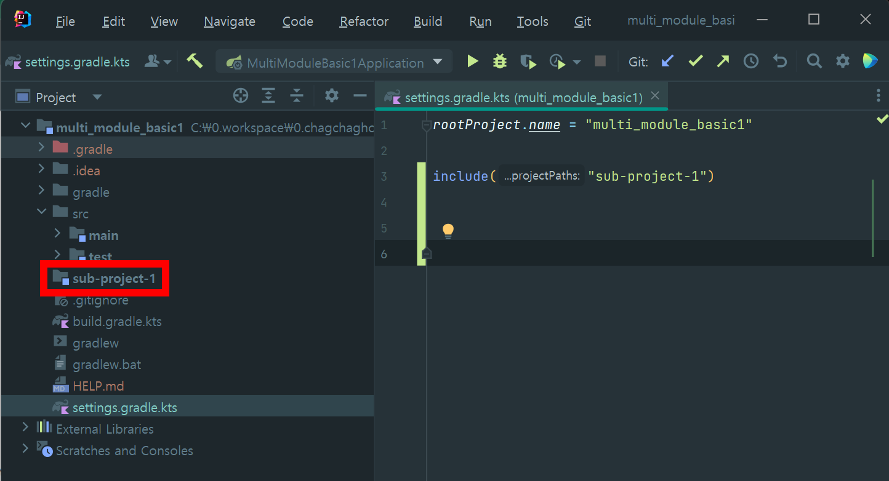
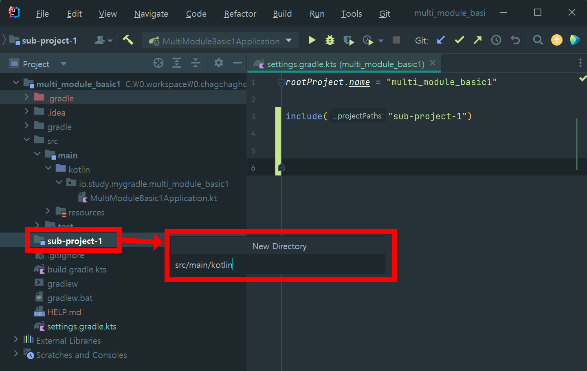
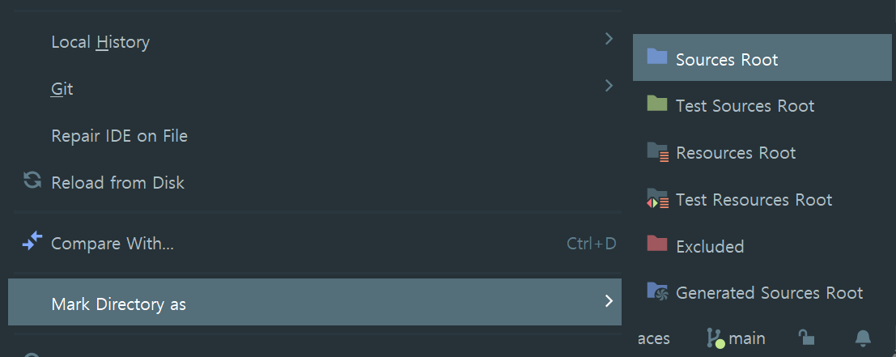
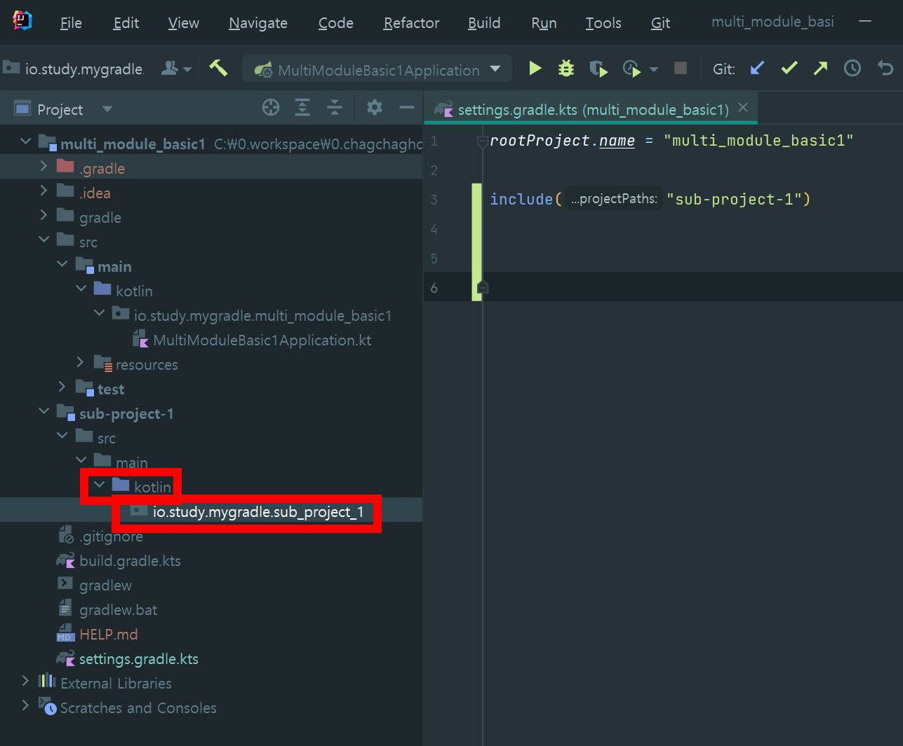
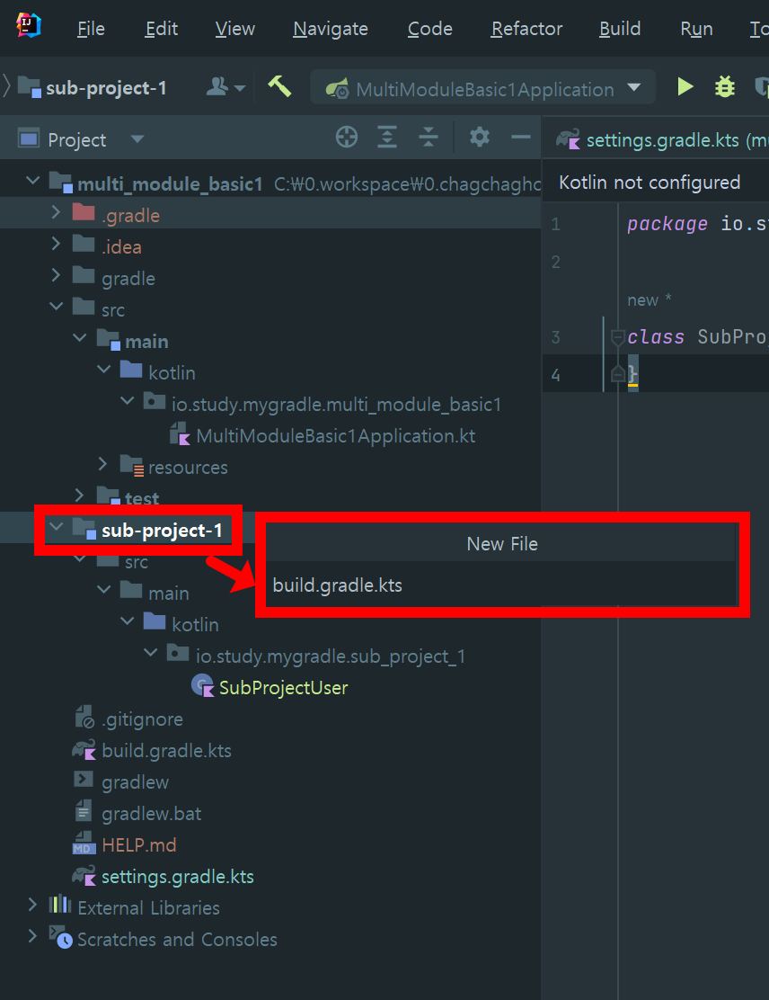
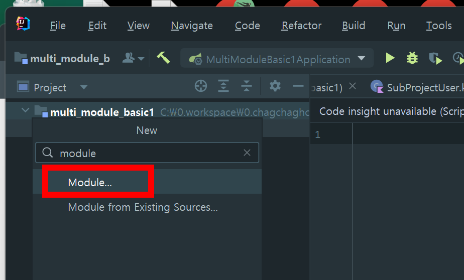
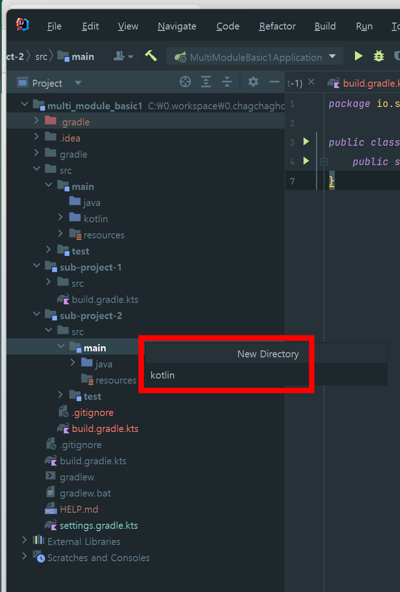

### 멀티모듈 구성 예제 (1)

프로젝트 내에서 여러개의 멀티 모듈을 구성해보고, 아래의 4가지를 실습해본다.

- 1\) 서브 모듈을 인텔리제이로 생성하는 법 vs 서브 모듈을 직접 생성하는 법
  - how to create a multi-module gradle project
- 2\) 하나의 모듈을 다른 모듈에서 import 해서 사용하는 법
  - how to import one module to another
- 3\) 의존성을 모듈들과 공유하는 방법
  - share dependencies between modules
- 4\) external 파일에 dependency 들을 저장해두는 방법
  - store dependencies in an external file

<br>


### 참고자료 
- [Multi module java project with Gradle | basics | subproject import | manage dependencies](https://youtu.be/pSKY3-K9_qc?si=bCKj2BweeDDRd1zl)

<br>


### 1\) 서브 모듈을 직접 생성하는 법 vs 서브 모듈을 인텔리제이로 생성하는 법 

생성할 모듈

- sub-project-1 : 직접 수작업으로 생성
- sub-project-2 : 인텔리제이로 서브 모듈을 생성

<br>


개인적으로는 위의 두 방법 중 수작업으로 생성하는 것을 선호하는 편.

<br>


#### 직접 수작업으로 서브모듈을 생성하기

##### 디렉터리 생성

프로젝트 루트 디렉터리에 Directory 를 생성한다.



<br>


`sub-project-1` 라는 이름의 디렉터리를 생성한 모습



<br>


##### settings.gradle.kts 수정 → reload

settings.gradle.kts 파일을 열고 `include("서브모듈 디렉터리명")` 을 작성해준 후 Reload 버튼을 클릭한다. 




이렇게 Reload 버튼을 클릭하고 나면 아래 캡처 처럼 Intellij 내에서 모듈로 표시된다.



<br>


##### src/main/kotlin 디렉터리 생성 & Mark Directory As ... \> Sources Root




Mark Directory As ... \> Sources Root 를 클릭




##### io.study.mygradle.sub\_project\_1 디렉터리 생성 

디렉터리를 생성하면 아래 그림처럼 패키지 아이콘으로 표시된다.




##### 패키지 내에 `SubProjectUser` 클래스 (코틀린) 생성

```kotlin
package io.study.mygradle.sub_project_1

class SubProject1User {
}
```

<br>


##### build.gradle.kts 생성

새로 생성한 모듈인 `sub-project-1` 내에 `build.gradle.kts` 파일을 생성한다. 

  


#### 인텔리제이에서 서브모듈 생성

인텔리제이로 생성할 때 일부 파일이 Java로 바뀌기도 하고 관련된 인텔리제이의 GUI 기능이 불안정하다.







생성된 kotlin 디렉터리는 아래와 같이 Sources Root 으로 설정해준다.


패키지를 생성한다.

- io.study.mygradle.sub\_project\_2 라는 이름의 패키지를 생성해줬다.

<br>


생성한 패키지 안에는 SampleProject2User.kt 클래스를 만들어주고 내용은 아래와 같이 정의해줬다. 

```kotlin
package io.study.mygradle.sub_project_2

class SubProject2User {
}
```

<br>


생성된 build.gradle.kts 파일은 아래와 같다.

```kotlin
plugins {
    id("java")
}

group = "io.study.mygradle"
version = "0.0.1-SNAPSHOT"

repositories {
    mavenCentral()
}

dependencies {
    testImplementation(platform("org.junit:junit-bom:5.9.1"))
    testImplementation("org.junit.jupiter:junit-jupiter")
}

tasks.test {
    useJUnitPlatform()
}
```


### 2\) 하나의 모듈을 다른 모듈에서 import 해서 사용하는 법


### 3\) 의존성을 모듈들과 공유하는 방법


### 4\) external 파일에 dependency 들을 저장해두는 방법


