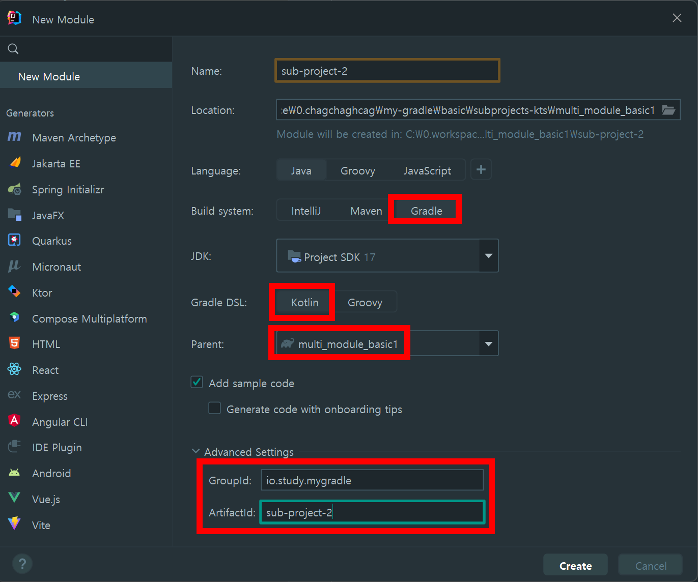

### 멀티모듈 구성 예제 (1)

프로젝트 내에서 여러개의 멀티 모듈을 구성해보고, 아래의 4가지를 실습해본다.

- 1\) 서브 모듈을 인텔리제이로 생성하는 법 vs 서브 모듈을 직접 생성하는 법
  - how to create a multi-module gradle project
- 2\) 하나의 모듈을 다른 모듈에서 import 해서 사용하는 법
  - how to import one module to another
- 3\) 의존성을 모듈들과 공유하는 방법
  - share dependencies between modules
- 4\) external 파일에 dependency 들을 저장해두는 방법
  - store dependencies in an external file

<br>


### 참고자료 
- [Multi module java project with Gradle | basics | subproject import | manage dependencies](https://youtu.be/pSKY3-K9_qc?si=bCKj2BweeDDRd1zl)

<br>


### 1\) 서브 모듈을 직접 생성하는 법 vs 서브 모듈을 인텔리제이로 생성하는 법 

생성할 모듈

- sub-project-1 : 직접 수작업으로 생성
- sub-project-2 : 인텔리제이로 서브 모듈을 생성

<br>


개인적으로는 위의 두 방법 중 수작업으로 생성하는 것을 선호하는 편.

<br>


#### 직접 수작업으로 서브모듈을 생성하기

##### 디렉터리 생성

프로젝트 루트 디렉터리에 Directory 를 생성한다.


<br>


`sub-project-1` 라는 이름의 디렉터리를 생성한 모습


<br>


##### settings.gradle.kts 수정 → reload

settings.gradle.kts 파일을 열고 `include("서브모듈 디렉터리명")` 을 작성해준 후 Reload 버튼을 클릭한다. 


이렇게 Reload 버튼을 클릭하고 나면 아래 캡처 처럼 Intellij 내에서 모듈로 표시된다.


<br>


##### src/main/kotlin 디렉터리 생성 & Mark Directory As ... \> Sources Root


Mark Directory As ... \> Sources Root 를 클릭


##### io.study.mygradle.sub\_project\_1 디렉터리 생성 

디렉터리를 생성하면 아래 그림처럼 패키지 아이콘으로 표시된다.


##### 패키지 내에 `SubProjectUser` 클래스 (코틀린) 생성

```kotlin
package io.study.mygradle.sub_project_1

class SubProject1User {
}
```

<br>


##### build.gradle.kts 생성

새로 생성한 모듈인 `sub-project-1` 내에 `build.gradle.kts` 파일을 생성한다. 

  


#### 인텔리제이에서 서브모듈 생성

인텔리제이로 생성할 때 일부 파일이 Java로 바뀌기도 하고 관련된 인텔리제이의 GUI 기능이 불안정하다.





생성된 kotlin 디렉터리는 아래와 같이 Sources Root 으로 설정해준다.


패키지를 생성한다.

- io.study.mygradle.sub\_project\_2 라는 이름의 패키지를 생성해줬다.

<br>


생성한 패키지 안에는 SampleProject2User.kt 클래스를 만들어주고 내용은 아래와 같이 정의해줬다. 

```kotlin
package io.study.mygradle.sub_project_2

class SubProject2User {
}
```

<br>


생성된 build.gradle.kts 파일은 아래와 같다.

```kotlin
plugins {
    id("java")
}

group = "io.study.mygradle"
version = "0.0.1-SNAPSHOT"

repositories {
    mavenCentral()
}

dependencies {
    testImplementation(platform("org.junit:junit-bom:5.9.1"))
    testImplementation("org.junit.jupiter:junit-jupiter")
}

tasks.test {
    useJUnitPlatform()
}
```


### 2\) 하나의 모듈을 다른 모듈에서 import 해서 사용하는 법

#### build.gradle(kts) : project, subprojects , allprojects

여기서 정리할 예제는 project, subprojects, allprojects 라는 속성에 대한 예제다.

- project(String)
  - 특정 프로젝트를 지정해서 task를 수행하는 방식이다.
  - 자세한 내용은 아래에 설명하는 예제를 확인
- subprojects 
  - 모든 subproject 각각에 대해 수행된다.
  - `A`, `B` `C` 라는 서브모듈이 있을때 만약 루트 프로젝트의 `build.gradle.kts` 파일 내의 subprojects{...} 내에 println("hello")를 호출하는 코드를 작성했다고 하면 `A`, `B` `C` 각각에 대해 "hello" 라는 문구가 출력된다.
- allprojects
  - 

<br>

#### project(String)

프로젝트 루트의 build.gradle.kts 를 아래와 같이 작성해준다.

```kotlin
import org.jetbrains.kotlin.gradle.tasks.KotlinCompile

// ...

project("sub-project-1"){
	apply(plugin = "org.jetbrains.kotlin.jvm")

	task("hello(sub-project-1)").doLast{
		println("project() >>> This is ${project.name}")
	}
}

// ...

```

<br>


그리고 인텔리제이의 우측 사이드바의 Gradle 메뉴에 생성된 Task 중 `hello(sub-project-1)` 을 실행해보자.

아래와 같은 결과가 나타난다.

```plain
> Task :sub-project-1:hello(sub-project-1)
project() >>> This is sub-project-1

...
```

<br>


#### subprojects{...}

이번에는 프로젝트 루트 내의 build.gradle.kts 에 subprjects 를 아래와 같이 작성해보자.

```kotlin
import org.jetbrains.kotlin.gradle.tasks.KotlinCompile

// ...

dependencies {
	implementation("org.springframework.boot:spring-boot-starter")
	implementation("org.jetbrains.kotlin:kotlin-reflect")
	testImplementation("org.springframework.boot:spring-boot-starter-test")
}

project("sub-project-1"){
  // ...
}

// ...

subprojects {
	apply(plugin = "org.jetbrains.kotlin.jvm")
	apply(plugin = "org.jetbrains.kotlin.plugin.spring")
	apply(plugin = "org.springframework.boot")
	apply(plugin = "io.spring.dependency-management")

	task("subprojects-println").doLast{
		println("subprojects {...} >>> This is ${project.name}")
	}
}

// ...

```


<br>

그리고 터미널에 아래 명령어를 수행한다.

- ./gradlew subprojects-println

<br>

수행 결과는 아래와 같다.

```plain
// ...
> Task :sub-project-1:subprojects-println
subprojects {...} >>> This is sub-project-1

> Task :sub-project-2:subprojects-println
subprojects {...} >>> This is sub-project-2
// ...
```

<br>


#### allprojects {...}

루트 프로젝트 내의 `build.gradle.kts` 의 내용을 아래와 같이 수정해준다.

```kotlin
import org.jetbrains.kotlin.gradle.tasks.KotlinCompile

plugins {
	id("org.springframework.boot") version "2.7.14"
	id("io.spring.dependency-management") version "1.0.15.RELEASE"
	kotlin("jvm") version "1.6.21"
	kotlin("plugin.spring") version "1.6.21"
}

project("sub-project-1"){
	apply(plugin = "org.jetbrains.kotlin.jvm")

	task("hello(sub-project-1)").doLast{
		println("project() >>> This is ${project.name}")
	}
}

project("sub-project-2"){
	apply(plugin = "org.jetbrains.kotlin.jvm")

	task("hello(sub-project-2)").doLast{
		println("project() >>> This is ${project.name}")
	}
}

subprojects {
	apply(plugin = "org.jetbrains.kotlin.jvm")
	apply(plugin = "org.jetbrains.kotlin.plugin.spring")
	apply(plugin = "org.springframework.boot")
	apply(plugin = "io.spring.dependency-management")

	task("subprojects-println").doLast{
		println("subprojects {...} >>> This is ${project.name}")
	}
}

allprojects{
	group = "io.study.mygradle"
	version = "0.0.1-SNAPSHOT"

	task("allprojects-println").doLast{
		println("allprojects {...} >>> This is ${project.name}")
	}

	java {
		sourceCompatibility = JavaVersion.VERSION_17
	}

	repositories {
		mavenCentral()
	}

	dependencies {
		implementation("org.springframework.boot:spring-boot-starter")
		implementation("org.jetbrains.kotlin:kotlin-reflect")
		testImplementation("org.springframework.boot:spring-boot-starter-test")
	}

	tasks.withType<KotlinCompile> {
		kotlinOptions {
			freeCompilerArgs += "-Xjsr305=strict"
			jvmTarget = "17"
		}
	}

	tasks.withType<Test> {
		useJUnitPlatform()
	}
}
```


대부분의 공통적인 내용인 group, java, repositories, dependencies, KotlinCompile 등을 allprojects 에 포함시켜줬다.

그리고 allprojects 내에서 수행할 태스크로 "allprojects-println" 이라는 태스크를 정의해줬다.

```kotlin
// ...

task("allprojects-println").doLast{
  println("allprojects {...} >>> This is ${project.name}")
}

// ...
```

<br>

이렇게 한 후 gradle 메뉴에서 루트프로젝트 \> other \> `allprojects-println` 을 클릭해서 실행하면 출력결과는 아래와 같이 나타난다.

```plain
> Task :allprojects-println
allprojects {...} >>> This is multi_module_basic1

> Task :sub-project-1:allprojects-println
allprojects {...} >>> This is sub-project-1

> Task :sub-project-2:allprojects-println
allprojects {...} >>> This is sub-project-2
```

<br>

sub-project-1, sub-project-2 을 모두 실행시키고, 자기 자신인 allprojects 에 포함된 태스크들 역시 실행했음을 확인 가능하다. 

<br>


### 3\) 의존성을 모듈들과 공유하는 방법

##### 예제를 위해 `common` 이라는 서브 모듈 생성

예제를 돌려보기 위해 common 이라는 서브 모듈을 생성해준다. 생성 과정은 생략하기로 했다. base package 명은 `io.study.mygradle.common` 이다. <br>

순서만 요약해보면, 아래와 같은 순서로 생성했다.

- common 이라는 이름의 Directory 를 생성
- common 밑에 build.gradle.kts 파일을 생성
- common 밑에 src/main/kotlin 디렉터리 생성
- src/main/kotlin 디렉터리를 Mark As \> Sources Root 로 지정
- common/src/main/kotlin 밑에 `io.study.mygradle.common` 패키지 생성
- 루트 디렉터리 내의 settings.gradle.kts 파일 내에 common 프로젝트 import
  - include("common")


<br>

> Intellij 메뉴를 사용하지 않고 직접 파일을 만들고 settings.gradle.kts 에 지정하는 방식을 선택했다. kotlin은 Intellij 에서 서브 모듈 생성 시 모든 모듈들에 java 파일을 만들어 내서 꽤 곤란할 때가 많다. 그래서 Intellij 의 기능을 가급적 사용하지 않는다.<br>

<br>


##### common 모듈 내의 build.gradle.kts

build.gradle.kts

```kotlin
tasks.getByName("bootJar"){
    enabled = false
}

tasks.getByName("jar"){
    enabled = true
}

repositories {
    mavenCentral()
}

dependencies{
    implementation("com.google.code.gson:gson:2.10")
}
```


##### CommonEntity.kt

CommonEntity 는 예제를 위해 만든 클래스이다.

common 모듈에서 gson을 사용하고 있는데 다른 모듈들 (sub-project-1, sub-project-2) 에서는 gson 을 라이브러리로 사용하고 있지 않을 경우에 대한 예제를 들기 위해 생성한 클래스이다. 

```kotlin
package io.study.mygradle.common

import com.google.gson.Gson
import com.google.gson.JsonObject

class CommonEntity (
    private val id : String,
    private val json: JsonObject = JsonObject()
){
    init {
        json.addProperty("msg", "hello")
        json.addProperty("age", "21")
        println("jsonStr = ${Gson().toJson(json)}")
    }
}
```


##### sub-project-1 에서 common 의 CommonEntity 를 상속한 클래스 작업

###### 문제점 : sub-project-1 에서는 common 의 gson 라이브러리를 읽어오지 못한다.

sub-project-1 에서 common 의 CommonEntity 를 상속한 클래스는 SubProject1User 다. 이 클래스는 아래와 같이 작성해줬다.

```kotlin
package io.study.mygradle.sub_project_1

import io.study.mygradle.common.CommonEntity

class SubProject1User (
    private val id : String
): CommonEntity(
    id = id,
    json = com.google.gson.JsonObject(), // 여기서 문제. 의존성을 불러오지 못한다.
) {
}
```


그런데 문제가 있다. sub-project-1 에서는 common 프로젝트 내에서 사용하는 gson 라이브러리를 가져다 쓸 방법이 없다. 즉 sub-project-1 의 라이브러리 의존성 중 필요한 라이브러리는 그대로 가져와서 사용하는 것이 불가능한 상태다.<br>

<br>


###### 해결 방법 : implementation(...) 대신 api(...) 을 사용한다.


### 4\) external 파일에 dependency 들을 저장해두는 방법


